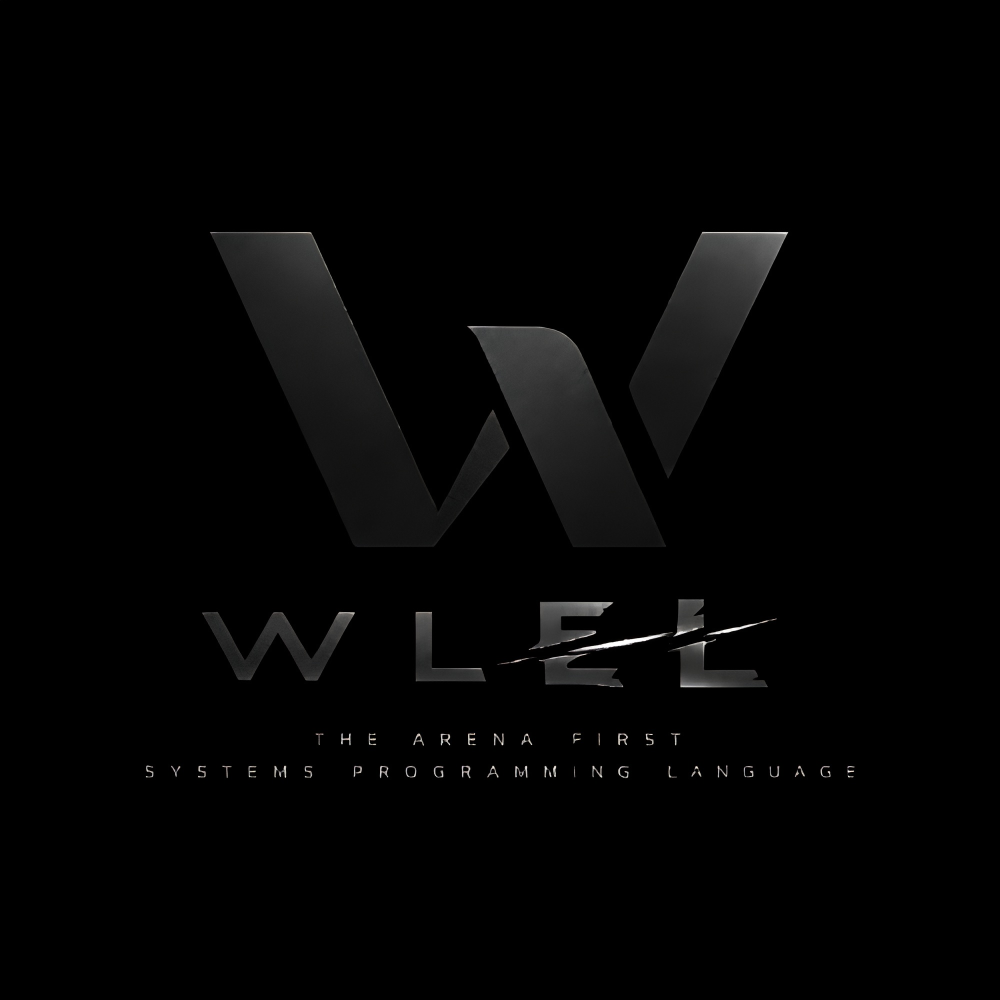

<div align="center">
  
</div>

# Wlel

[](https://github.com/WildanDeveloper/wlel/actions/workflows/ci.yml)
[](https://github.com/WildanDeveloper/wlel/actions/workflows/fuzz.yml)

**The Arena-First Systems Programming Language**

Simple enough to learn in one afternoon. Fast as C. Zero leaks by construction.

```wl
use std;

struct Node { val: int, next: *Node }

fn main() -> int {
    // 1 MiB bump arena: every allocation inside is an O(1) pointer bump
    arena(1 << 20) {
        let head: *Node = 0 as *Node;
        i := 0;
        while i < 100_000 {
            n := new(Node);   // typed, arena-aware
            n.val = i;
            n.next = head;
            head = n;
            i += 1;
        }
        std::println_int(head.val);
    } // <- all 100k nodes freed together in O(1). Zero leak, zero GC pause.

    return 0;
}
```

Wlel transpiles to clean, human-readable C99 and compiles with `cc`/`gcc`/`clang`
at `-O2`/`-O3`. There is no VM, no GC, and no runtime above C — benchmarks are at
parity with hand-written C (`fib(35)`: 12 ms vs C's 11 ms). What you get on top
is a modern type checker, first-class arenas as language syntax, deterministic
`defer`, and tooling that ships in a single binary.

---

## Why is this unique?

Every language "has arenas". Wlel is the only one where **the arena is the syntax**:

| | How you get memory safety | The catch |
|---|---|---|
| **C/C++** | Discipline + third-party arena libraries | Manual `free`, leaks, use-after-free |
| **Rust / Zig** | Arena as a library pattern (`ArenaAllocator`) | You have to remember to use it |
| **Go / Java** | Garbage collector | GC pauses, 2–3x memory overhead |
| **Wlel** | `arena(bytes) { ... }` + `new(T)` — **in the language itself** | — |

Inside an `arena` block you never write `free`. Early `return`, `break`, and
`defer` are safe by construction: return values are evaluated *before* the arena
is freed (LIFO unwind — verified with AddressSanitizer). Strings you build with
`+` live in a root arena that is released automatically at exit, so **Wlel
programs pass LeakSanitizer by default** — something C and C++ cannot claim.

## Feature status (pre-1.0)

### Language
- [x] First-class arenas: `arena(size) { ... }`, `arena { ... }` (default 4 KiB), `wlel_arena()`
- [x] Typed allocator: `new(T)`, `new(T, count)` — arena-aware, falls back to heap outside arenas
- [x] Root arena: temporaries and global allocations freed at exit via `atexit` — zero leaks end-to-end
- [x] Safe unwind: early return / `break` / `defer` inside arenas evaluate the return value first
- [x] `defer` — LIFO at scope exit, loop-aware, early-return-aware; multi-statement `defer { ... }` blocks with their own defer scope
- [x] Control flow: `if / else if / else`, `while`, `for i in a..b`, `break`, `continue`
- [x] Structs (nominal, C layout), struct literals, field access with auto-deref; forward & recursive definitions
- [x] Pointers (`*T`, `&`, `*`), arrays `[T; N]` with C-style decay, `wlel_sizeof(T)`
- [x] Casts: `expr as T` (numerics, pointers, int↔ptr)
- [x] Compound assignment `+= -= *= /= %=`, bitwise `& | ^ ~ << >>`
- [x] Modules: recursive `use "path.wl";` with diamond-import deduplication, `use std;`
- [x] FFI: `extern fn sqrt(x: f64) -> f64;` binds straight to C symbols; structs are C structs (see [FFI](#ffi))
- [x] Reserved identifier prefix `_wlel_` protected by the compiler

### Numbers
- [x] Width types: `u8 u16 u32 u64, i8 i16 i32 i64, usize, f32 f64` (`int` = i64, `float` = f64, `byte`/`char` = u8)
- [x] Literal suffixes: `10u8`, `2.5f32`, full u64 range (`18_446_744_073_709_551_615u64`)
- [x] Untyped literals adapt to context with range checks; narrowing requires an explicit cast; mixed widths require a cast
- [x] Overflow is never UB — see [Overflow semantics](#overflow-semantics)

### Diagnostics & tooling
- [x] Source spans everywhere: errors point at `file.wl:12:5`; `#line` directives map cc errors back to `.wl`
- [x] Parser error recovery: one compile reports *all* syntax errors, not just the first
- [x] Warning system: unused variables/parameters/imports, unreachable code — non-fatal, `_`-prefix opt-out
- [x] Built-in tests: `test "name" { ... }` blocks + `wlel test` runner with `file:line` failures
- [x] Safe-debug mode: `wlel run`/`wlel test` compile with array bounds checks, integer div-zero checks and arena poison-fill; `wlel build` stays zero-overhead (see [Safe-debug vs release](#safe-debug-vs-release))
- [x] Arena stats: `arena_stats() -> ArenaStats { bytes, chunks, peak }` for the innermost active arena (root when none)
- [x] `wlel build -sanitize` — ASan-instrumented release binary
- [x] CLI: `wlel run` (content-cached binaries), `wlel build -o out [-O0..-O3] [-sanitize] [--emit-c] [-l <lib>] [-L <dir>]`, `wlel check`, `wlel test`
- [x] Lexer: hex/bin/oct/scientific/`_`-separated literals, strings with escapes + UTF-8
- [x] Type checker: inference, annotations, return-path analysis, loop/arena depth tracking
- [x] Generics: `fn id[T](x: T) -> T` and `struct Box[T] { val: T }` via checker-level monomorphization — type inference at call sites, per-type instantiation (mangled C like `Box__int`), no boxing, no vtables (see [Generics](#generics))
- [x] Methods: `impl Pt { fn len(self) -> float { ... } }` + `p.len()` — desugared to plain functions, generic impls monomorphize per receiver; std collections/Result/Option carry a method layer (see [Methods](#methods))
- [x] Stdlib: `std::print*`/`println*`, `strlen`, `streq`, `abs`, `min`, `max`, `len`, `checked_add/sub/mul`, `format`, `parse_float`, `float_to_str`; collections `Vec[T]`, `HashMap[K,V]` + `for x in coll`; string library `str_find/sub/trim/split/parse_int`, `int_to_str`, `str_cmp`; sort & search `std::sort`, `std::binary_search`; file I/O `sys::read_file/write_file` + the Result layer `std::fs::open/read_all/write_all/read/write/close`; `sys::argc/arg/exit`
- [x] Concurrency: `sys::thread/join` (name-resolved workers, per-thread arenas), `sys::mutex_new/lock/unlock/free`, `sys::chan_new[T]/send/recv/close/free`, `sys::sleep_ms` — data races are user discipline, like C (see [Concurrency](#concurrency))
- [x] Tagged enums + exhaustive `match`, `std::Result[T,E]` / `std::Option[T]`, the `?` try operator and the `result_*`/`option_*` helpers, `panic(msg)` (see [Tagged enums](#tagged-enums--match) and [File I/O](#file-io))
- [x] Projects: `wlel new`, `wlel.toml` manifests, path + git dependencies (auto-cloned, revision-pinned by `wlel.lock`), nested deps, `wlel run/build/check/test` in project mode (see [Projects](#projects))
- [x] Package registry v0: `wlel add github:user/repo[@x.y.z]` — no central server, git tags are the registry; caret version requirements verified against each tag's own manifest, offline-friendly resolution (see [Projects](#projects))
- [x] Formatter: `wlel fmt` — canonical, idempotent, comment-preserving; `wlel fmt` in a project formats every `.wl`; `-check` mode for CI (see [Formatting](#formatting))
- [x] Language server: `wlel lsp` — diagnostics, hover types/signatures, go-to-definition (locals, methods, fields, imports), completion; hand-rolled LSP 3.17 over stdio, zero dependencies (see [Language server](#language-server))
- [x] Documentation: `wlel doc` — markdown pages from `///` doc comments, one per module plus an index; the embedded stdlib documents itself (see [Documentation](#documentation))

### Not yet (planned, in order)
- [ ] Self-hosting

### Experimental
- [x] QBE backend (`--backend qbe`): transpiles the arena-free core of the language straight to QBE IL — 75x faster builds on a 2k-function file (78 ms vs 5.9 s for gcc -O2 on generated C), runtime parity on straight-line/loop code, ~3x slower on gcc-transformed patterns like deep recursion (see [QBE backend](#qbe-backend-experimental))

## Specification

The normative language definition lives in [docs/spec.md](docs/spec.md) —
**v1 draft for public review**. It pins down the load-bearing contracts:
lexical structure, the full precedence table, evaluation order (what is
guaranteed, what is inherited from C), conversion/literal rules, `defer` and
`?` semantics, the memory model (arena lifetime, aliasing discipline,
poison-fill behavior), overflow semantics, safe-debug vs release, the FFI
type mapping, and a reference grammar. An [open questions](docs/spec.md#17-open-questions-for-review)
section lists the as-implemented behaviors that are explicitly up for
review before the 1.0 syntax freeze.

## Try it

Requires a C compiler (`cc`, `gcc`, or `clang`) and Rust/Cargo to build `wlel` itself.

```bash
cargo run --release -- run examples/arena.wl             # scoped arena demo
cargo run --release -- run examples/loops.wl             # for-in range demo
cargo run --release -- run examples/strings.wl           # string concat/eq demo
cargo run --release -- run examples/args.wl -- greet you # CLI args demo
cargo run --release -- run examples/fileio.wl -- examples/fileio.wl # cat demo (file I/O)
cargo run --release -- run examples/generics.wl          # generic fn/struct demo
cargo run --release -- run examples/sort.wl              # sort & search demo + 1M int benchmark
cargo run --release -- run examples/overflow.wl          # wrap + checked ops demo
cargo run --release -- run examples/concurrency.wl       # worker pool demo (threads + mutex + channel)
cargo run --release -- run examples/fib.wl               # fibonacci benchmark
cargo run --release -- test examples/strings.wl          # run the test blocks in a file
cargo run --release -- test examples/kitchen.wl          # tests from imports run too
cargo run --release -- check examples/kitchen.wl         # type-check only
cargo run --release -- build examples/arena.wl -o arena -O3 --emit-c
```

Project mode (needs `wlel` on PATH):

```bash
wlel new myapp && cd myapp   # scaffold: wlel.toml + src/main.wl
wlel run                     # run the project (dev checks)
wlel test                    # project + dependency tests
wlel build                   # binary named after the package
wlel fmt                     # canonical formatting for every .wl
wlel doc                     # markdown docs for every .wl + the stdlib
wlel lsp                     # language server over stdio (VS Code, Neovim)
wlel add github:user/repo    # add a git dependency (git tags = the registry)
```

## A quick tour

Declarations, functions, control flow:

```wl
fn fib(n: int) -> int {
    if n < 2 { return n; }
    return fib(n - 1) + fib(n - 2);
}

fn main() -> int {
    x := 41;              // inferred
    let y: int = x + 1;   // annotated
    for i in 0..3 { std::println_int(i); }
    return fib(10);
}
```

`defer` runs at scope exit — LIFO, and it runs on early returns and loop jumps:

```wl
fn process(path: string) -> int {
    defer std::println_str("done");
    defer {
        std::println_str("cleanup step 1");
        std::println_str("cleanup step 2");
    }
    if path == "" { return 1; }   // defers still run
    return 0;
}
```

Width types make data layouts exact; narrowing is always explicit:

```wl
let small: u8 = 250u8;      // suffix literal
let wrapped: u8 = small + 10;   // wraps to 4 (mod 256), by design
let big: u64 = 18_000_000_000_000_000_000u64;
let risky: u8 = small as u8;    // explicit cast required for narrowing
```

## Tagged enums & match

`enum` declares a closed tagged union; `match` destructures it — the checker
rejects missing variants, duplicates, and arms after the wildcard:

```wl
enum Shape {
    Circle(float),
    Rect(float, float),
    Point,
}

fn area(s: Shape) -> float {
    return match s {
        Circle(r) => 3.14159 * r * r,
        Rect(w, h) => w * h,
        Point => 0.0,
    };
}
```

`std::Result[T, E]` and `std::Option[T]` are ordinary enums in the stdlib, so
`match` works on them — and `expr?` is the terse form: propagate the error
variant out of the enclosing function, otherwise yield the payload. It is
allowed directly as the value of a `let`, an assignment, a `return`, or as a
statement:

```wl
fn parse_age(s: string) -> Result[int, string] {
    n := 0;
    if !str_parse_int(s, &n) { return Err("not a number"); }
    return Ok(n);
}

fn double(s: string) -> Result[int, string] {
    v := parse_age(s)?;          // on Err: return Err(e) out of double
    return Ok(v * 2);
}
```

Predicates, fallbacks and explicit unwraps live in the stdlib (written in Wlel
itself): `result_is_ok/is_err/unwrap/unwrap_or/ok/err`,
`option_is_some/is_none/unwrap/unwrap_or`. The unwraps `panic(msg)` — abort
with the message and `.wl` position; a test run fails that one test and keeps
going. Everything else in a Wlel program errors at compile time or returns a
Result — implicit panics do not exist.

## Generics

Functions and structs can be generic over types; each use is monomorphized to a
concrete instance at compile time — zero runtime cost:

```wl
struct Box[T] {
    val: T,
}

fn box_get[T](b: Box[T]) -> T {
    return b.val;
}

fn main() -> int {
    let b: Box[float] = Box { val: 2.5 };
    std::println_float(box_get(b));   // 2.5
    return 0;
}
```

Type arguments are usually inferred from the call (`first(1, 2)` needs no
`[int]`); explicit ones work too. Every concrete instantiation is emitted under
a mangled name (`Box__int`, `Box__Box__int`), so nested generics and generics
inside arenas/safe-mode compose naturally. A generic that is never called is
never monomorphized — its body is not even checked.

## Methods

`impl` blocks attach methods to structs and enums. The checker lowers every
method into a plain function (`Pt__len`) and `recv.method(args)` resolves into
that call — no vtables, no dynamic dispatch, just sugar with compile-time
resolution:

```wl
struct Pt {
    x: float,
    y: float,
}

impl Pt {
    // value receiver: reads a copy
    fn len(self) -> float {
        return std::math::sqrt(self.x * self.x + self.y * self.y);
    }

    // pointer receiver: mutates in place
    fn scale(self: *Pt, k: float) {
        self.x *= k;
    }
}

fn main() -> int {
    p := Pt { x: 3.0, y: 4.0 };
    std::println_float(p.len()); // 5
    p.scale(10.0);               // auto-borrow: &p for a pointer method
    pp := &p;
    std::println_float(pp.len()); // auto-deref: (*pp).len()
    return 0;
}
```

Receiver rules, in one sentence: the receiver adapts to the declared `self`
form — a pointer method on a value auto-borrows (the value must be an lvalue),
a value method on a pointer auto-derefs. Generic impls repeat the type's own
parameters (`impl Box[T] { ... }`) and methods monomorphize per receiver like
generic functions. Enums take methods too, destructured with `match` inside.

The stdlib carries a method layer over the free functions — same operations,
attached to their types:

```wl
v := vec_new[int]();
v.push(2);
v.push(3);
std::println_int(v.len());        // 2

m := map_new[string, int]();
m.set("a", 1);
std::println_int(m.get_or("a", 0)); // 1

let r: Result[int, string] = Ok(17);
if r.is_ok() {
    std::println_int(r.unwrap()); // 17
}
```

The free functions (`vec_push`, `map_get`, `result_unwrap`, ...) remain — std
internals call them directly; methods are the idiomatic surface.

## Overflow semantics

Integer arithmetic in Wlel **never panics and is never undefined** — results are
fully defined in debug and release alike:

| Case | Behavior |
|------|----------|
| Unsigned (`u8..u64`, `usize`) | wrap modulo 2^N (standard C) |
| Signed (`i8..i64`) | two's-complement wrap — the backend compiles with `-fwrapv` |
| Widths below 32 bits | the compiler inserts explicit wrap casts, so wrapping happens at the original width, not in C's `int` |

When wrapping is *not* what you want, the stdlib detects overflow — no
exceptions, no panics:

```wl
use std;

fn main() -> int {
    r := 0;
    if std::checked_add(9_000_000_000, 9_000_000_000, &r) {
        std::println_int(r);          // safe: r is valid
    } else {
        std::println_str("overflow"); // r holds the wrapped value — don't use it
    }
    return 0;
}
```

`std::checked_add/sub/mul(a: int, b: int, out: *int) -> bool` returns `false` on
overflow. Note the builtins still store the wrapped result in `*out` even when
they return `false` — treat `*out` as valid only when the call returned `true`.

## File I/O

Two layers, both arena-aware. **Whole-file helpers** for the common case:

```wl
use std;

fn cat(path: string) -> Result[int, string] {
    content := std::fs::read_all(path)?;   // Err = strerror message
    std::print_str(content);               // a cat in one fallible line
    return Ok(0);
}

fn main() -> int {
    match cat("notes.txt") {
        Ok(_) => { return 0; }
        Err(e) => {
            std::println_str("cannot read notes.txt: " + e);
            return 1;
        }
    }
}
```

**Streaming handles** for buffers and binary data — `close` is idempotent and
defer-friendly, handles die with their arena, so LeakSanitizer stays clean:

```wl
f := std::fs::open("data.bin", "rb")?;      // in a fn returning Result
defer std::fs::close(f);
buf := new(u8, 4096);
while true {
    n := result_unwrap(std::fs::read(f, buf, 4096));  // bytes read; 0 = EOF
    if n == 0 { break; }
    // ... process buf[0..n) ...
}
```

- `sys::read_file(path, &out) -> bool` / `sys::write_file(path, contents) -> bool` — the raw layer, no import required
- `std::fs::*` — the Result layer, `use std;` required: `open(path, mode) -> Result[*File, string]`,
  `read_all(path) -> Result[string, string]`, `write_all(path, contents) -> Result[int, string]`,
  `read(f, buf: *u8, n) -> Result[int, string]`, `write(f, buf: *u8, n) -> Result[int, string]`,
  `close(f)` — every Err payload is a C `strerror` message or a short literal;
  file I/O never panics
- `expr?` propagates the error out of any function returning Result/Option
  (let, assignment, return, or as a statement); `match` destructures; the
  `result_*` / `option_*` helpers cover predicates, fallbacks and the explicit
  unwraps (which `panic` with a message when the value is absent)
- Strings are NUL-terminated: after a partial read, set `buf[n] = 0` before
  treating the slice as a string; true binary data stays in `*u8` buffers

## Sort & search

`std::sort` and `std::binary_search` take an ordinary Wlel function as the
comparator — `cmp(a, b) -> int`, negative / zero / positive like `strcmp`.
No function pointers, no `qsort` `void*`: the compiler emits a specialized
C sort per (element, comparator) pair, so the comparator call inlines at
`-O2` (1M random ints sort in ~77 ms — faster than C `qsort` at ~111 ms on
the same machine, which pays for indirect calls):

```wl
use std;

fn asc(a: int, b: int) -> int {
    if a < b { return -1; }
    if a > b { return 1; }
    return 0;
}

fn main() -> int {
    a := [5, 3, 9, 1];
    std::sort(a, asc);                          // fixed array [T; N]
    v := vec_new[string]();
    vec_push(&v, "pear");
    vec_push(&v, "apple");
    std::sort(v, str_cmp);                      // Vec[T], stdlib comparator
    i := std::binary_search(a, 9, asc);         // index of a match, or -1
    return 0;
}
```

Three collection forms work for both functions: `(arr, cmp)`,
`(ptr, n, cmp)` and `(vec, cmp)` — `binary_search` takes the needle before
the comparator. Sorting is in-place, not stable (like C `qsort`); any
element type works, structs included — write a comparator over a field.

## Concurrency

Threads, mutexes and channels, portable over pthreads / Win32 — and honest
about the model: shared state is plain memory, data races are the user's
responsibility, exactly like C. The language hands you the discipline
tools and the sanitizer catches the fallout (`wlel build -sanitize` keeps
the pool LeakSanitizer-clean; an OOB read inside any thread aborts with a
`file:line` in dev mode).

```wl
fn worker(p: *Pool) {
    job := 0;
    while sys::chan_recv(p.jobs, &job) {   // blocks; false = closed + drained
        sys::mutex_lock(p.mu);
        *p.total = *p.total + job * job;
        sys::mutex_unlock(p.mu);
        sys::chan_send(p.done, job);
    }
}
```

- `sys::thread(work, data) -> *Thread` — spawns an OS thread running
  `work(data)`. Wlel has no function pointers: the worker is resolved by
  name, takes exactly one parameter (the data is type-checked against it)
  and must return `void`. Every thread gets a fresh root arena of its own
  and frees it when it exits.
- `sys::join(t)` — block until the thread finishes; joining releases the
  handle (join once, like `free`).
- `sys::mutex_new/lock/unlock/free` — dynamic mutexes; lock/unlock
  discipline is yours, `mutex_free` destroys and frees.
- `sys::chan_new[T]()` — an unbounded FIFO of any one type (int, string,
  pointers, structs). `sys::chan_send(ch, v) -> bool` never blocks (false
  once the channel is closed); `sys::chan_recv(ch, &out) -> bool` blocks
  until a value arrives, and returns false when the channel is closed and
  drained (`*out` untouched — the same bool + out-param idiom as
  `sys::read_file`); `sys::chan_close(ch)`, `sys::chan_free(ch)` finish the
  lifecycle. `sys::sleep_ms(ms)` parks the current thread.
- A failed `assert`/`panic` inside a spawned thread aborts the process with
  its `file:line` (it never jumps into a foreign test stack).

The full demo — a worker pool computing a mutex-guarded total over a job
channel — is `examples/concurrency.wl` (`wlel run examples/concurrency.wl`).

## Testing

Tests live next to the code they verify, in plain `.wl` files:

```wl
fn add(a: int, b: int) -> int {
    return a + b;
}

test "basic arithmetic" {
    assert_eq(add(1, 1), 2);
    assert_eq("he" + "llo", "hello");
}

test "string" {
    assert("arena" != "borrow");
}
```

```bash
$ wlel test math.wl
pass: basic arithmetic
pass: string
2 passed, 0 failed
```

- **`assert(cond)`** and **`assert_eq(a, b)`** are builtins usable in tests and
  ordinary code. `assert_eq` uses the same comparison semantics as `==`
  (literal width adaptation, explicit casts for narrowing).
- A failed assert reports the **source location**: `FAIL: kaput (main.wl:5)`.
- One failing test does not stop the suite — the runner catches it and
  continues; the exit code is non-zero if anything failed.
- `wlel test file.wl` also runs tests from **imported files** (`use "lib/x.wl"`),
  so libraries ship their own tests. `wlel run`/`wlel build` ignore test blocks
  entirely — zero overhead in the shipped binary.

## FFI

`extern fn` declares a C function; the call compiles to a direct C call and
the linker resolves the symbol.

```wl
use std;

// double sqrt(double) — libm is linked by default
extern fn sqrt(x: f64) -> f64;

// libc: int puts(const char*), int atoi(const char*)
extern fn puts(s: string) -> i32;
extern fn atoi(s: string) -> i32;

fn main() -> int {
    puts("sqrt(2) is about");
    std::println_int(atoi("3") + 1);   // 4
    std::println_float(sqrt(2.0));     // 1.41421...
    return 0;
}
```

- **Declare the exact C types.** Wlel `int` is i64 (C `long long`), so C
  `int` is `i32`, C `size_t` is `usize`, C `double` is `f64`. A mismatched
  declaration is caught by cc as a conflicting-types error.
- **Wlel structs are C structs** — same fields, same order, same layout
  (locked by `static_assert`/`offsetof` tests). Third-party bindings
  (raylib, SDL) name their structs exactly as C does; the C header is
  never included, so the Wlel declaration *is* the binding:

  ```wl
  struct Vector2 { x: f32, y: f32 }
  extern fn begin_drawing();
  extern fn draw_circle_v(center: Vector2, radius: f32, color: Color);
  ```

  ```bash
  wlel build examples/raylib.wl -o demo -l raylib -L raylib/lib
  ```

- **Linker flags**: `-l <lib>` and `-L <dir>` are repeatable on
  `wlel build`, `wlel run`, and `wlel test`, and pass straight through to
  cc (`-l raylib -L raylib/lib`).
- **Variadic C functions** (`printf`) cannot be declared — wrap them or
  use `std::format`.
- The generated prototype is non-`static`; a repeated *compatible*
  declaration is fine (the prelude already declares libc), but never
  redeclare a libc typedef — bind a name the headers do not define.

## Projects

A project is a directory with a `wlel.toml`. Scaffold one and run it:

```bash
$ wlel new myapp
created new project in ./myapp
next: cd myapp && wlel run
$ cd myapp && wlel run
hello, wlel!
```

Layout:

```text
myapp/
  wlel.toml      # manifest: name, version, deps
  src/main.wl    # binary entry (run/build)
  src/lib.wl     # library entry (optional; check/test work on library-only projects)
  .wlel/deps/    # git-dependency clones (generated — gitignore it)
  wlel.lock      # resolved git revisions (generated — commit it)
```

All verbs work in project mode when no `.wl` file is given — `wlel run/build/
check/test` look for `wlel.toml` in the current directory (or any parent).
`wlel build` writes a binary named after the package; `-o` overrides it.
Library-only projects (with `src/lib.wl` but no `src/main.wl`) can be checked
and tested but not built/run.

Dependencies are declared in `[deps]` — either a path to another wlel project
or a git URL (cloned automatically into `.wlel/deps/<name>`):

```toml
[package]
name = "myapp"
version = "0.1.0"

[deps]
pointlib = { path = "../pointlib" }
json     = { git = "https://github.com/user/wlel-json", version = "1.2" }
```

`wlel add` edits the manifest for you — resolve first, write second, so a
broken dependency never leaves a half-edited manifest behind:

```bash
$ wlel add github:user/wlel-json@1.2          # shorthand → https://github.com/...
$ wlel add json https://example.com/repo.git  # explicit name, full URL
$ wlel add pointlib --path ../pointlib        # path dependency
added 'json' (git = "https://github.com/user/wlel-json") (satisfies 1.2 via tag v1.2.3)
next: wlel run
```

Dependency functions, structs and tests merge into your program (like file
imports, diamond-deduped), nested dependencies resolve recursively, and two
dependencies sharing a name from different sources are rejected. Git
revisions are pinned in `wlel.lock` after the first build — commit it, and
every later build checks out exactly that revision, even on machines that
have never seen the repo. Delete the lock to move to the remote's HEAD.

Git dependencies can pin a **version requirement** (`version = "1.2"`):
caret semantics like Cargo's `^` — `1.2` matches `>=1.2.0 <2.0.0`, `0.2.3`
matches `>=0.2.3 <0.3.0`. There is no central server: **git tags are the
registry** (`v1.2.3` and `1.2.3` both count). Resolution picks the highest
tag satisfying the requirement and then verifies the tag's own `wlel.toml`
declares a compatible version — tag and manifest must tell the same story.
`wlel.lock` records the requirement together with the revision
(`name = "1.2@<sha>"`), so builds stay reproducible and raising the
requirement re-resolves automatically. Everything prefers the local clone:
once locked, later builds never touch the network, and even re-resolution
falls back to already-fetched tags when the remote is unreachable.

## Formatting

`wlel fmt` re-prints source from the parse tree, so its output is canonical
and **idempotent** — formatting twice changes nothing:

```bash
$ wlel fmt src/main.wl        # format in place
formatted: src/main.wl
$ wlel fmt src/main.wl -check # CI mode: exit 1 if not canonical
all formatted
$ wlel fmt                    # project mode: every .wl under wlel.toml
```

The rules are deliberately few: 4-space indent, one statement per line,
exactly one blank line between top-level declarations (adjacent `use` lines
stay grouped; blank lines inside blocks collapse to one), `//` comments kept
(above the construct they precede, or trailing where they were), and
parenthesization rebuilt from precedence — `(a + b) * c` keeps its parens,
`a + (b * c)` loses them. Width-suffixed literals stay attached (`10u8`,
`2.5f32`), floats always print float-typed (`1e3` → `1000.0`), and radix
literals normalize to decimal (`0xFF` → `255`). A file that does not parse
is never touched.

## Warning system

`wlel check`, `wlel build`, and `wlel run` report warnings without failing the build:

```
$ wlel check main.wl
main.wl:7:5: warning: unused variable 'unused'
main.wl:1:1: warning: import 'geom.wl' is never used
ok: main.wl type-checks
```

- **Unused variable / parameter** — declared but never read (a plain write
  `x = 5;` does not count as a read).
- **Unused import** — `use std;` with no `std::` call, or `use "file.wl"`
  contributing no referenced function or struct.
- **Unreachable statement** — code after `return`/`break`/`continue` in the same block.
- **Opt-out** — prefix a name with `_` (`_x`, `_i`, `_cb`) to mark intentional
  non-use.

## Language server

`wlel lsp` speaks LSP 3.17 over stdio — hand-rolled, zero dependencies like
the rest of the toolchain. It runs the real pipeline (parse with error
recovery, import merge, `use std` splice, type checker) on every edit, so
what the editor shows is what the compiler sees:

- **Diagnostics** — syntax errors (all of them, one compile), the first type
  error, and warnings (unused var/param/import, unreachable code), each with
  the exact range.
- **Hover** — variable/field types, function and method signatures, struct
  and enum shapes, variant payloads, pattern-binding types.
- **Go-to-definition** — locals (with shadowing), functions, methods
  (`v.push()` lands on the `impl` block), structs, enums, variants, struct
  fields, and `use "file.wl"` imports (opens the file). Generic calls and
  desugared method calls resolve back to their template declarations.
- **Completion** — locals in scope, top-level symbols, spliced std symbols
  (`vec_new`, `push`, `Ok`, ...), keywords and primitive types.

### Editor setup

**Neovim** (built-in LSP client, `init.lua`):

```lua
vim.api.nvim_create_autocmd('filetype', {
  pattern = 'wlel',
  callback = function()
    vim.lsp.start({
      name = 'wlel',
      cmd = { 'wlel', 'lsp' },
      root_dir = vim.fs.root(0, { 'wlel.toml' }),
    })
  end,
})
```

**VS Code** — point a generic LSP client at `wlel lsp` (e.g. via the
"any-lsp" style extensions), or launch it manually:

```bash
wlel lsp   # speaks on stdin/stdout; diagnostics on open/change
```

Notes:
- The stdlib is embedded in the compiler, so std symbols resolve even
  without a `std` source file on disk; go-to-definition on a std symbol
  reports a `wlel-std:` URI (the source is not a file you can open).
- Unsaved buffers analyze fine, but `use "file.wl"` imports need the
  document saved next to its imports.

## Documentation

`wlel doc` generates markdown from `///` doc comments — one page per module
(source file) plus an `index.md`. A doc comment attaches to the declaration
directly below it (a blank line in between still attaches); an unattached
block at the top of the file becomes the module description. Plain `//`
comments are never docs:

```wl
/// A point in the plane.
struct Pt {
    x: float,
    y: float,
}

/// Distance from the origin.
fn len(p: Pt) -> float {
    return sqrt(p.x * p.x + p.y * p.y);
}
```

```bash
$ wlel doc                    # project mode: every .wl + the stdlib page
doc: docs/std.md
doc: docs/geom.md
doc: docs/index.md
$ wlel doc src/geom.wl        # single file (adds std.md when it `use std`)
$ wlel doc --std              # just the stdlib reference
$ wlel doc -o site            # write somewhere other than docs/
```

Each page reprints the full API from the parse tree (structs and enums as
definition blocks, functions as signatures, `impl` methods grouped under
their type) with the doc text below each item — a file that fails to parse
is never documented. The stdlib page (`std.md`) is generated from the
embedded library itself, plus a hand-maintained table for the compiler
builtins that have no Wlel source (`std::print*`, `std::math::*`,
`sys::thread`, ...). The output is plain markdown — GitHub Pages, mkdocs or
any viewer renders it as-is.

## Safe-debug vs release

Wlel compiles the same program two ways:

- **`wlel run` / `wlel test` (dev, safe)** — instrumented C. Every `[T; N]`
  array access is bounds-checked, every integer `/` and `%` is div-zero
  checked, and freed arena memory is poisoned with `0xDE` so use-after-free
  reads deterministic garbage. Failures abort with the exact `.wl` position:

  ```
  $ wlel run main.wl
  bounds check failed at main.wl:12: index 7, length 3
  $ wlel run div.wl
  division by zero at div.wl:4
  ```

- **`wlel build` (release)** — none of that exists in the generated C
  (verify with `--emit-c`: zero check helpers, zero poison). Same binary
  speed as before, same IEEE float semantics (`1.0/0.0` is `inf` in both
  modes — only integer division is guarded).

Notes:
- Pointers from `new(T, n)` have no tracked length, so they are not bounds
  checked — only static `[T; N]` arrays are.
- The checks are lazy (part of the access expression), so short-circuit
  semantics are preserved.
- When the optimizer can prove an index in range, even the dev build's
  check is folded away. On a check-heavy microbenchmark (data-dependent
  indices, divisions in the hot loop) dev costs ~30%; typical code is at
  or near parity (fib(35): release ≈ C).

## Arena stats

`arena_stats()` reports the innermost active arena (the root arena when no
block is open). `ArenaStats` is a built-in struct — the name is reserved:

```wl
arena(4096) {
    xs := new(int, 100);
    let s: ArenaStats = arena_stats();
    std::println_int(s.bytes);   // 800 — int is 8 bytes
    std::println_int(s.chunks);  // 1
    std::println_int(s.peak);    // 800 — high-water mark
}
```

For memory debugging beyond the built-in checks, `wlel build -sanitize`
produces an AddressSanitizer-instrumented binary (the same binary still
passes LeakSanitizer at exit thanks to the root arena):

```bash
wlel build app.wl -o app -sanitize && ./app
```

## QBE backend (experimental)

`wlel build --backend qbe` skips C entirely for your program: the compiler
emits [QBE IL](https://c9x.me/compile/) directly, `qbe` lowers it to assembly,
and `cc` only assembles and links. Requires `qbe` in `PATH` (`apt install qbe`).

This is an *experiment* (roadmap Fase 3), deliberately scoped to the
arena-free core of the language:

- **Supported:** all integer widths + wrap semantics, `f32`/`f64`, bools,
  pointers, stack arrays with indexing and decay, strings (literals, `==`,
  indexing), `if`/`while`/`for`/`break`/`continue`, functions, monomorphized
  generics, `extern fn` (`-l`/`-L` pass through), `wlel_print_*`,
  `sys::argc/arg/exit/mono_ms/unix_ms`, `wlel_sizeof`.
- **Refused with `file:line:col`:** `use std` and file imports, structs,
  enums, `impl` methods, `defer`, `arena{}`, `new()`, `test` blocks, `match`,
  for-in — anything needing the C runtime. Use the C backend there.
- `--emit-c` emits the IL (`.ssa`) instead.

Measured on one machine (Debian, gcc 12, qbe 1.2), honest both ways:

| | C backend | QBE backend |
|---|---|---|
| cold build, 2000-function / 30k-line file | 5883 ms | **78 ms** (75x) |
| runtime, loop-heavy straight-line program | 0.57 ms | 0.58 ms (parity) |
| runtime, `fib(35)` (gcc rewrites recursion into loops) | 12 ms | 36 ms (~3x) |
| binary size (fib) | 16.3 KB | 16.8 KB |

Outputs are byte-identical with the C backend across the parity test corpus.

**Decision recorded in the roadmap:** the C backend stays the default. QBE is
worth keeping as an opt-in fast-iteration path — its whole-pipeline build
speedup is real and the code it emits for straight-line programs is already at
parity — but it does not replace gcc-class optimization for
transform-heavy code, and the language is moving faster than a second
production backend could track. Revisit when the language is closer to 1.0.

## Toolchain notes

- Generated C is meant to be read: `wlel build --emit-c` writes the C99 source
  next to your binary, with `#line` directives so compiler diagnostics point
  back into your `.wl` files.
- `wlel run` caches compiled binaries by content hash — rebuilds only happen
  when the source actually changes.
- The compiler never rejects a program on warnings, and one syntax error never
  hides the next: the parser recovers and reports everything it finds.

## Roadmap

Ordered by impact-per-effort. The next milestones:

1. **Stdlib & tooling** — generics via monomorphization, `Vec[T]`/`HashMap[K,V]`, string library, file I/O, `wlel fmt`, CI, FFI.
2. **Expressiveness** — tagged enums + exhaustive `match`, `Result[T,E]`, method sugar, concurrency, LSP, `wlel doc`.
3. **1.0** — package registry, a QBE backend experiment, three flagship apps (HTTP server, JSON parser, a small game), fuzz soak, full docs, cross-compile recipes.

Deliberately **not** on the roadmap: borrow checker, macros, GC, OOP class
hierarchies, exceptions. Simplicity is a feature, not a phase.
